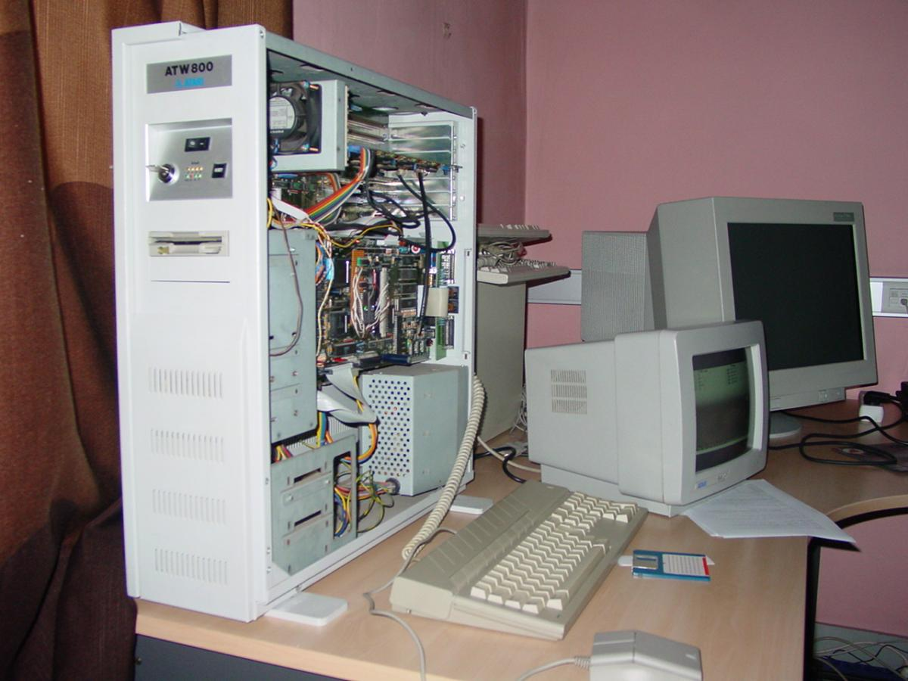

[](assets/atw800-desktop.jpg)
\[Photo taken from [https://atariage.com/forums/topic/197988-atari-atw800-video-question/](https://atariage.com/forums/topic/197988-atari-atw800-video-question/)\]

The first time I saw the ATW800 in action was during the HCC computer fair.
Attached was a giant glass CRT, that was so heavy it was literally crushing the table.

# Atari Transputer Workstation <br> <span style="font-size: .5em">[https://wikipedia.org/wiki/Atari_Transputer_Workstation](https://wikipedia.org/wiki/Atari_Transputer_Workstation)</span>

This project is dedicated to resurrecting the Atari Transputer Workstation (ATW-800) to demonstrate how advanced this computer system was for 1989. 
For transparency and education, also restoring the sources of all the binaries, and if possible creating a demo to give it tribute well deserved.  

# The Transputer stole my heart

The Inmos T800 was designed with the philosophy: "If a CPU invented today with the knowledge we already have, how would it look like?"

- No registers

    There are only special purpose registers, notably Instruction pointer IPTR (aka pc) and workspace pointer WPTR (aka sp).

- No condition code

    Comparisons are explicitly performed and their outcome stored as value, `false`=0 and `true`=1. 

- No operands, replaced with operand stack

    Traditionally instructions have multiple operands with multiple addressing modes, which are not always orthogonal. 
    The transputer detaches the operands from the opcodes and instead uses a register stack to load instruction inputs and to store the result.
    The stack is 3-registers deep.   

- Instructions are bytecode based. 

    Instructions are encoded as a 4-bit opcode and a 4-bit unsigned operand.
    Memory references and indices are word based. Characters have their specialised load/store instructions. 

    The 16 base instructions are:

    TOS = Top Of operand Stack, WPTR = Workspace Pointer (aka stack pointer) 
  
|  code  | mnemonic | <span style="width:20ex;">name</span> | <span style="width:60ex;">description</span>                                     |
|:------:|:--------:|:--------------------------------------|:---------------------------------------------------------------------------------|
| `0x0x` |   `j`    | jump                                  | jump to address `x`                                                              |
| `0x1x` |  `ldlp`  | load local pointer                    | push address of `((word*)wptr)[x]` on operand stack                              |
| `0x2x` |  `pfix`  | prefix                                | extend prefix with `x`                                                           |
| `0x3x` |  `ldnl`  | load non local                        | pop TOS and push `((word*)wptr)[pop+x]` on operand stack                         |
| `0x4x` |  `ldc`   | load constant                         | push constant `x` on operand stack                                               |
| `0x5x` |  `lnlp`  | load non-local pointer                | pop TOS and push address of `((word*)mem)[pop]` on operand stack                 |
| `0x6x` | `npfix`  | negative prefix                       | extend prefix with `x` creating negative numbers                                 |
| `0x7x` |  `ldl`   | load local                            | push word `((word*)wptr)[x]` on operand stack                                    |
| `0x8x` |  `adc`   | add constant                          | add constant `x` to TOS                                                          |
| `0x9x` |  `call`  | call                                  | call subroutine located at `x`                                                   |
| `0xAx` |   `cj`   | conditional jump                      | pop TOS and jump to `x` if zero                                                  |
| `0xBx` |  `ajw`   | adjust workspace                      | add constant `x` to WPTR                                                         |
| `0xCx` |  `eqc`   | equals constant                       | compare TOS with `x` and change TOS to 1 if equal and 0 otherwise                |
| `0xDx` |  `stl`   | store local                           | pop TOS and store at word `((word*)wptr)[x]`                                     |
| `0xEx` |  `stnl`  | store non local                       | pop TOS for address of ``((word*)mem)[pop]``, pop TOS again to store value there |
| `0xFx` |  `opr`   | operate                               | perform one of the other 153 instructions                                        |

- 4-bits operand can be extended using prefix instructions.

    The 4-bit operand value can be extended by adding an extra leading 4-bits by the `pfix` and `npfix` instructions. 
    `npfix` is needed to create negative values.
    Advantage, no need to store leading zeros. Disadvantage, adds one extra instruction byte for each extended 4-bits. 
    Weirdly, although the transputer is little endian, the prefixed approach make number construction big endian.

- Amazing instructions

    The transputer has some amazing instructions for calculating CRC, reversing and counting bits in words,
    and a two-dimensional block mode for efficient copying, overlaying and clipping of graphics.

- Process scheduling in hardware

    In the absence of registers and condition code, it becomes fairly easy to maintain a process context (being the workspace pointer).  
    The transputer has a built-in process scheduler based on voluntary CPU releasing. 
    A limited number of instructions like unconditional jump, loop end and I/O instructions are eligible for a process reschedule.

    This makes, by definition, all code thread safe!

- 4 high speed serial connections

    The Transputer introduces the concept of channels which is a DMA driven `memcpy()`. 
    Two instructions are needed, one to setup the transmitting size, and the other to setup the receiving side. 
    When both side are armed (the order is independent), the transfer will commence. 
    The marvel of the transputer is that the memory transfer can be either internally within the same chip,
    or externally using one of the 4 serial communication links.

    This makes it possible to perform a cross-platform `memcpy()`!

- Position independent code

    With default 4-bits operands, it is a natural choice to have branches, jumps and calls be instruction pointer relative.  
    This allows snippets of code to be easily relocated and/or transferred to other nodes.   

- (ATW specific) Blossom

    The Blossom video chip is capable of 1280x960 with 16 colours, which resolution is more than modern standard HD (1280*720). 
    In comparison, the mega-ST has 320x200 with 16 colours.

# Instruction example

   The C expression `A = B + 0x123` would translate to:

```
    0x1x   ldl B    load B from memory and push on operand stack
    0x21   pfix 1   load 4 bits constant as prefix for next instruction (prefix = 0x1)  
    0x22   pfix 2   extend the prefix (prefix = prefix<<4 | 0x2)  
    0x43   ldc 3    Load 0x3 with prefix and push on operand stack (value = prefix<<4 | 0x3)
    0xf5   add      pop 2 operands, add and push result
    0xdx   stl A    pop result and store in memory
    6 bytes
```
    
   For the 68000 this would be:

```
    30 2e ff fc     move  -4(fp),d0
    d0 7c 01 23     add   #$123,d0
    3d 40 ff fe     move  d0,-2(fp)
    12 bytes
```

# Multi-board design

The ATW-800 is a dual computer system consisting of a custom version of the Atari Mega-ST [https://wikipedia.org/wiki/Atari_MEGA_STE](https://wikipedia.org/wiki/Atari_MEGA_STE) 
  and an Inmos T800 Transputer based motherboard and a dedicated Blossom based video board. 
There are also 4 expansion slots to hold farmcards fitted with 4 T800 each, and an external connector to attach 4 other ATW800 systems.

## T800

The main-board has a single T800 and 4M memory. It is connected via a local bus and dual-ported memory to the Blossom based daughter-board. The highest resolution supported is 1280*960, which is more than modern HD with 1280*720. 
The difference being in colour depth, Blossom supports 4 bits whereas HD supports 24 bits.  

The power of the main-board can be extended with farmcards which are connected through high-speed serial links.  
The topography of the nodes are determined by physically wiring the link cables and their connectors.

The T800 runs the Helios distributed operating system from Perihelion. Helios is available for the T880, Motorola 680x0 and the Texas Instruments TMS320C40 DSP.
The graphical library is X11R4 with a custom backend for the Blossom. 
As expected, it is possible to redirect the X11 network traffic using `DISPLAY=` for even more parallelism. 

## Mega-ST

The Meta-ST with the TOS operating system is used as front-end console to handle keyboard, mouse, storage and secondary display (640*400 monochrome).

The mega-board is a custom design fitted with the B016 link controller. 
The component layout of the board is significantly different hinting that there may be Easter eggs.

The Mega-ST runs standard TOS with additional runtime loaded drivers to access the SCSI controller and extend the filesystem cache. 
The main program `server.prg` accesses the link controller and is responsible for booting the T800 cluster and handling I/O requests.

# Projects/repositories

- Atari drivers
- Alcyon toolchain for Atari
- Atari link-connector I/O sub-system
- Helios OS
- T800 compiler
- gcc 1.35 for T800 (it fits in 4M memory)
- X11R4
- X11R4 display driver
